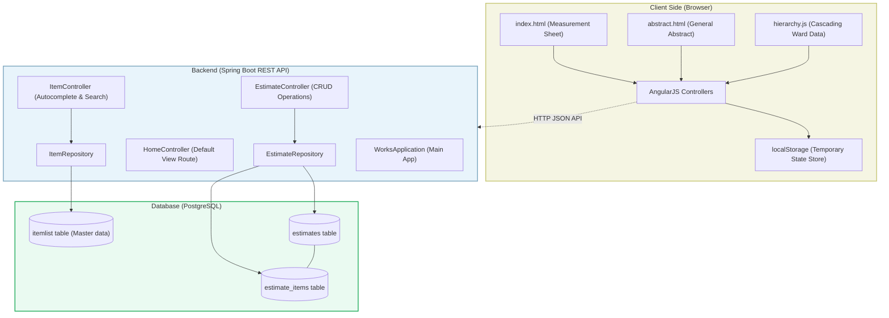
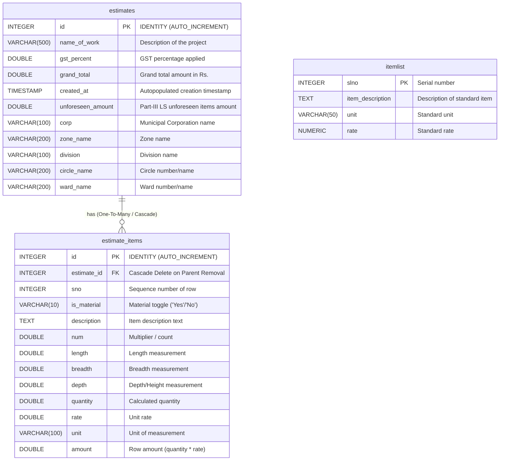
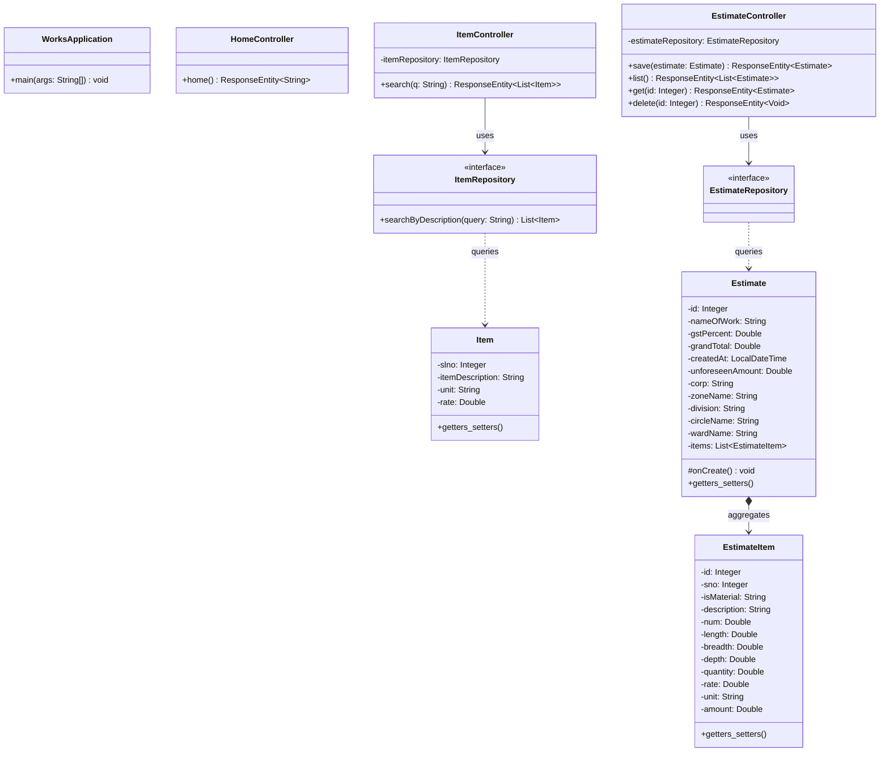
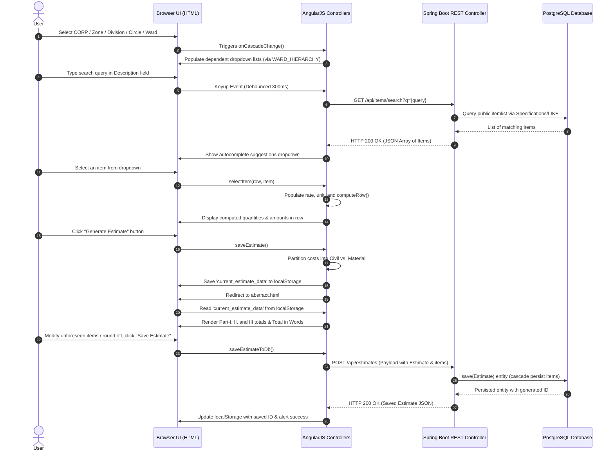

# Codebase Diagrams and Architecture Documentation

This document provides a comprehensive view of the **HMWSSB Works Measurement and Estimation System** architecture, data flow, database schema, and class hierarchy.

---

## 1. High-Level Architecture Diagram
The application follows a **monolithic client-server architecture** using an **AngularJS** SPA (Single Page Application) frontend connected via REST endpoints to a **Spring Boot** backend, which persists data to a **PostgreSQL** database.

---

## 2. Database Schema (Entity-Relationship Diagram)
The database persists estimates and their dynamic list of estimate items. The system also reads from a static/master `itemlist` table for autocomplete entries.

---

## 3. Class Diagram (Backend Java Structure)
This class diagram details the fields, repositories, and endpoints of the Spring Boot application.

---

## 4. Sequence Diagram (Measurement to Abstract & Save Flow)
This diagram illustrates the lifecycle of generating and saving an estimate, starting with selection and row inputs on `index.html` all the way to DB persistence on `abstract.html`.

